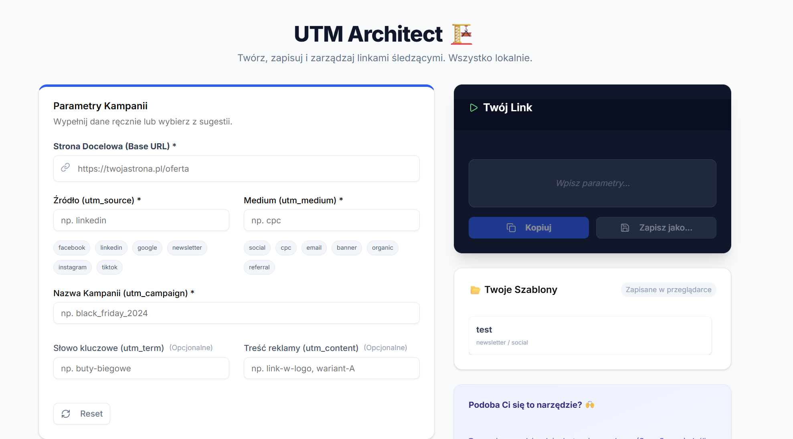

# UTM Architect 🏗️


**A privacy-first, local UTM link builder for professional marketers.**

UTM Architect is a modern web application designed to replace messy Excel spreadsheets. It allows marketers to generate, manage, and save tracking links entirely within their browser. No data is ever sent to a server.



## 🚀 Key Features

* **100% Privacy Focused:** All processing happens locally in your browser. No data leaves your device.
* **Complete UTM Support:** Supports standard parameters (`source`, `medium`, `campaign`) and advanced options (`term`, `content`) added in v1.1.
* **Smart Templates:** Save your most used configurations as "Presets" (stored in `localStorage`).
* **Instant Copy:** One-click copy to clipboard with auto-validation.
* **Developer Experience:** Built with modern web standards, fully typed.

## 🛠️ Tech Stack

This project was built to showcase the power of Next.js 14 App Router combined with client-side logic.

| Category | Technology |
|----------|------------|
| **Framework** | [Next.js 14](https://nextjs.org/) (App Router) |
| **Language** | [TypeScript](https://www.typescriptlang.org/) |
| **Styling** | [Tailwind CSS](https://tailwindcss.com/) |
| **UI Components** | [Shadcn/ui](https://ui.shadcn.com/) |
| **Icons** | [Lucide React](https://lucide.dev/) |
| **State Management** | React Hooks + LocalStorage |

## 📦 Getting Started

To run this project locally:

1.  **Clone the repository:**
    ```bash
    git clone [https://github.com/your-username/utm-architect.git](https://github.com/your-username/utm-architect.git)
    ```

2.  **Install dependencies:**
    ```bash
    cd utm-architect
    npm install
    # or
    yarn install
    ```

3.  **Run the development server:**
    ```bash
    npm run dev
    ```

4.  Open [http://localhost:3000](http://localhost:3000) with your browser.

## 🤝 Contributing

Contributions, issues, and feature requests are welcome!
Feel free to check the [issues page](https://github.com/your-username/utm-architect/issues).

## ❤️ Support the Creator

I built this tool as Open Source software because I believe in free, privacy-friendly tools for everyone.

**I am currently training for the Warsaw Half Marathon to support cancer patients.**
If this tool saved you time or helped you in your work, please consider donating to my Charity Run ("Biegam Dobrze").

👉 **[Donate to my Charity Run Here](https://rejestracja.maratonwarszawski.com/pl/fundraising/78340dd5-a8e8-4540-8852-2222942ed145)**

Even a small donation ($5 / 20 PLN) helps me reach the start line and support the fight against cancer!

---

*Built with ❤️ in Warsaw.*